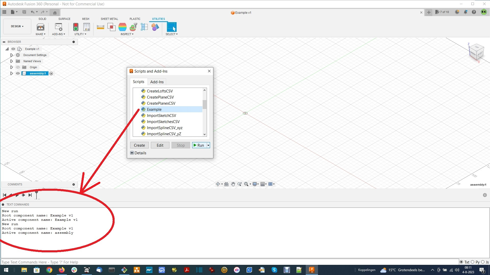
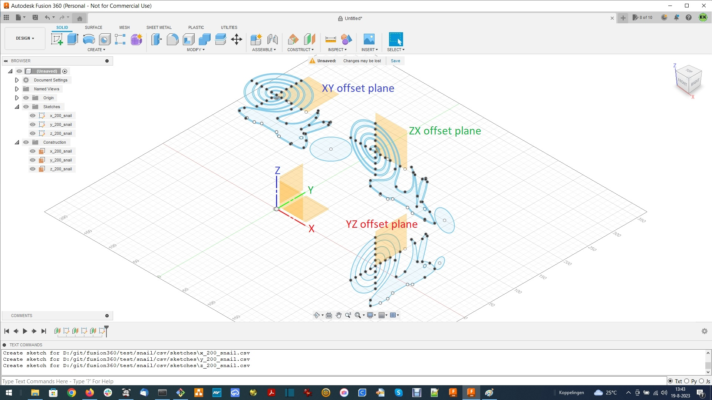
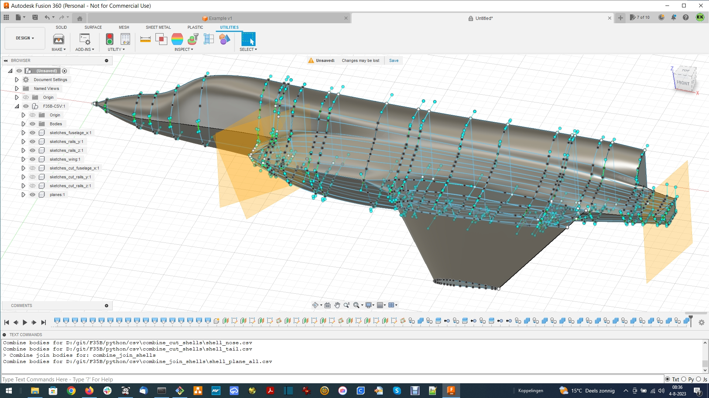

# Scripts to create objects in Fusion360 from CSV files using the API

For more information please also check my channel "Eric Kooistra - Hobby" on YouTube: https://www.youtube.com/channel/UCnQhySYKmPyZsY2G8S3CUbA

## 1. Overview
### 1.1. Design actions and hierarchy
The CSV files define actions and hierarchy for a design in Fusion360. There are three levels of CSV files:
1. action CSV files: define single 'create' and 'modify actions, as in the SOLID menu in the Fusion360 GUI.
2. assembly CSV files: define an assembly component and a series of action CSV files
3. design CSV file: define a sequence of assembly CSV files to build a design toplevel assembly with multiple sub assemblies.

The CSV files can be accessed in the Fusion360 GUI using the API/Scripts. There are API/scripts for each CSV file level. The API/Scripts can be ran via the UTILITIES/ADD-INS/Scripts and Add-Ins menu in the Fusion360 GUI. The scripts are in Python. The Python code consists of:
* API/libraries that contains library files that are used in the other scripts for handling CSV files and Fusion360 objects.
* API/Scripts that contains scripts that can run in Fusion360 to create objects like sketches, planes, lofts, bodies, components and assemblies from CSV files.

The CSV files define (a part of) the timeline in Fusion360. The API/Scripts operate on individual CSV files, but for design entry in a text file it is more convenient to have multiple actions together in one file. Therefore the script csv_timeline360.py is available to convert a single text file into multiple CSV files.

> txt file --> csv_timeline360.py in terminal --> CVS files --> API/Script in Fusion360 --> design timeline

Typically there is one txt file per:
* assembly CSV file, to define an assembly and the action CSV files for that assembly
* design CSV file, to define the list of assembly CSV files for the design toplevel assembly

### 1.2. Parameters and equations
Another advantage of design entry via the txt files is that the txt file can use parameters and equations to define values for e.g. coordinates, angles, lengths, distances. The csv_timeline360.py evaluates these parameters and equations, and then writes their numerical result into the CSV files.

### 1.3. Examples
The simplest object to create with a CSV file is a single sketch, using API/Scripts/ImportSketchCSV. The snail_points.txt provides an example of defining a sketch.

The most elaborate object to create with a CSV file is a complete design toplevel assembly, that consists of sub assemblies, using API/Scripts/DesignCSV. The f35b_csv.txt provides an example of a design for an F35B airplane toplevel assembly, that consists of several sub assemblies and is defined by in total about 300 CSV files.

During design development in the txt file and in Fusion360 it is convenient to use the other API/Scripts to be able to apply individual CSV files in Fusion360. The scripts interact with the user via message boxes and dialog boxes and report results via the TEXT COMMANDS window in the Fusion360 GUI.


## 2. API/libraries
Functions to converting an assembly timeline file into separate CSV files:
* interfacefiles.py - functions to create separate CSV files from a text file.
* userparameters.py - functions process parameters in a timeline file.

Functions to ease using the Fusion360 API:
* schemacsv360.py - functions to represent items defined in CSV schema files in Fusion360.
* interface360.py - functions for user IO in the Fusion360 GUI.
* utilities360.py - functions for handling objects in Fusion360.
* samples360.py - functions for example samples to experiment with the API in Fusion360.

Functions to parse and excecute action CSV files in Fusion360:
* importsketch.py - import a sketch from a CSV file.
* createplane.py - create a plane from three points defined in a CSV file.
* createloft.py  - create a loft from sketch profiles and rails defined in a CSV file.
* combinebodies.py - combine bodies defined in a CSV file
* extrude.py  - extrude sketch profile or text defined in a CSV file.
* splitbody.py - split body defined in a CSV file.
* modifyedges.py - modify edges of body with fillet or chamfer operation defined in a CSV file.
* movecopy.py - move, copy, remove, or transform operation defined in a CSV file.
* mirror.py - mirror body or component defined in a CSV file.
* constructassembly.py - construct assembly defined in a CSV file, using sketches, planes, bodies
* buildassemblies.py - build multiple assemblies into an toplevel design component defined in a CSV file

## 3. API/Scripts
The path to the API/Scripts directory needs to be set in Fusion360 via menu Preferences/General/API in the Fusion360 GUI.

### 3.1 Design scripts
* AssemblyCSV - Generic script to construct an assembly in Fusion360 as defined in an assembly CSV file.
* DesignCSV - Generic script to build a design in Fusion360 with one or more assemblies as defined in an design CSV file.

### 3.2 General scripts for processing one action CSV file, or a directory with multiple action CSV files
* ImportSketchCSV, ImportSketchesCSV - Import sketch as defined in CSV file.
* ExtrudeCSV, ExtrudesCSV - Extrude sketch profile as defined in CSV file.
* CreateLoftCSV, CreateLoftsCSV - Create loft as defined in CSV file.
* CreatePlaneCSV, CreatePlanesCSV - Create plane as defined in CSV file.
* SplitBodyCSV, SplitBodyMultipleCSV - Split body as defined in CSV file.
* CombineBodiesCSV, CombineBodiesMultipleCSV - Combine bodies as defined in CSV file.
* ModifyEdgesCSV - Modify edges of body with fillet or chamfer operation as defined in CSV file.
* MoveCopyCSV - Move, copy, remove or transform an object as defined in CSV file.
* MirrorCSV - Mirror object as defined in CSV file.

### 3.3 Example scripts
### 3.3.1 Example script
The Example script demonstrates some script development basics in Fusion360 by printing parameter values and object names in the TEXT COMMANDS window of Fusion360, as shown below.



#### 3.3.2 ImportSketchCSV and ImportSketchesCSV scripts with csv_timeline360.py
The test/snail/snail_points.txt file defines three sketches of a snail in Fusion360. The three sketches are made in different offset planes of the XY, YZ and ZX origin planes. First in test/snail run 'python ../../csv_timeline360.py -f snail_points.txt' on the command line in a terminal, to create separate CSV files in a csv/sketches folder from snail_points.txt. One CSV file can be read into Fusion360 using the ImportSketchCSV script, or all three CSV files can be read at once into Fusion360 using the ImportSketchesCSV script.



#### 3.3.3 AssemblyCSV script with csv_timeline360.py
The csv_timeline360.py creates CSV files from F35B/f35b_points.txt for a F35B plane fuselage and wing. First in F35B/ run 'python ../csv_timeline360.py -f f35b_points.txt' on the command line in a terminal, to create separate CSV files in a csv/ folder. The F35B design in the F35B-CSV assembly component shown below, can then be generated in Fusion360 from these CSV files, by running the AssemblyCSV Script with the csv/F35B-CSV/F35B-points.csv file in the Fusion360 GUI (takes about 2 minutes).



The test/hatches/hatches.txt file shows how to use sketch, extrude, text, modifyedges with fillet and chamfer.

#### 3.3.4 DesignCSV script with csv_timeline360.py
Additional timeline actions for the F35B-CSV assembly component are defined in f35b-pin-holes.txt and f35b-aileron.txt. First create F35B-pin-holes.csv and F35B-aileron.csv using csv_timeline360.py on the command line in a terminal. After that the AssemblyCSV Script in Fusion360 can be used to perform the additional timeline actions defined in the assembly CSV files F35B-pin-holes.csv and in F35B-aileron.csv.

The separate assembly timeline actions can also be performed automatically by using the DesignCSV script in Fusion360 with the F35B-CSV.design.csv file. This design CSV file is defined by f35b_csv.txt. First create all CSV files in a terminal, using on command line:

```
> python ..\\csv_timeline360.py -f ^
f35b_points.txt,^
f35b_pin_holes.txt,^
f35b_aileron.txt,^
f35b_vertical_stabilizer.txt,^
f35b_elevator.txt,^
f35b_printing_parts.txt,^
f35b_airplane.txt,^
f35b_csv.txt
```

Then run F35B-CSV.design.csv with DesignCSV script in the Fusion360 GUI. The script execution takes a few minutes, and when done it echos its steps in the TEXT COMMANDS window.

## 4 Directory (folder) tree of CSV files
The CSV files are organised in two folder levels:
* The CSV file for an assembly defines the assembly folder. The assembly folder can contain one or more assembly CSV files, that in series form a sequence of timeline actions, that together form the entire timeline for that assembly in Fusion360.
* The CSV files for timeline actions that belong to the assembly and that belong together are grouped in group folders. The group folder can be the same folder as the assembly folder, or a sub folder within the assembly folder.

Example of an directory tree for CSV files that together define an assmbly in Fusion360:
```
    assembly folder/group folder a/action csv files
                    group folder b/action csv files
                    group folder ...
                    assembly csv file 0
                    assembly csv file 1
                    assembly csv file ...
```

## 5 Fusion360 objects

### 5.1 Component and occurrence
An occurrence is like an instance of a component. There can be one or more occurrences of a component. The place in design hierarchy of a new component also is its first occurrence. For the root component there is no occurrence, because there can only be one root component.
* The root component can not be moved or copied.
* Component names are unique in the design.
* The CSV actions only create new components, therefore there is always only one occurrence of each component.

### 5.2 Sketch, plane, body
Sketches, planes and bodies have an unique name within a component, but can have the same name in different components. Therefor if a component is copied or mirrored, then there will be duplicate sketch, plane and bodies names in a design.


## 6 Hierarchy in Fusion360

### 6.1 Two levels
The assembly consist of an assemblyComponent and groupComponents. For an assembly the assemblyComponent is placed under the activeComponent. If the assemblyComponentName is not specified, then it defaults to the activeComponent. The activeComponent is the component in Fusion360 that is active when the AssemblyCSV script it ran.
* The assemblyComponent is used as hostComponent for the groupComponents. The results of a timeline action are placed in the groupComponent. If the groupComponent is used, then the groupComponentName should be the same as the group folder name in the directory tree. If the groupComponentName is not specified, then the group result objects will be placed in the assemblyComponent.
* A groupComponent contains the result objects of one or more timeline actions that belong together.

### 6.2 Multiple levels
To have more hierarchical freedom than the two level scope of assemblyComponent/groupComponent, it is also possible to define a component hierarchy for the assemblyComponent, for the groupComponent and to specify the component for input and target objects:
* assemblyComponentName = 'a/b/c' will use component 'a' as top level assembly component, 'b' as some intermediate level assembly and 'c' as sub assembly compoment. It will also create component hierarchy, if it does not already exist in the design in Fusion360.
* groupComponentName = 'd/e' will use component 'e' as groupComponent, but will also create intermediate component 'd' if necessary, to achieve component hierarchy activeComponent/a/b/c/d/e in Fusion360.

### 6.3 Input object search
Input objects, like sketch, plane, body, for timeline actions can be found by their 'object name' or by combination of 'parent component name/object name':
* If a timeline action depends on other objects, then it looks anywhere in the assemblyComponent to find objects that it has to operate on. In this way it can also find objects that are placed in other groupComponents within the assemblyComponent. The objects then must have a object name that is unique in the hostComponent and in all its child components.
* Alternatively input and target object names can be identified uniquely in the entire design by using their parent component name as well, because all component names are unique in a Fusion360 design. The object name 'd/object name' then uniquely identifies the object with that object name anywhere in component 'd'. For example if the object is d/e/f/object and its object name is unique in d/, then 'parent component name/object name' as 'd/object name', or 'e/object name' or 'f/object name' are all equivalent ways to identify it.


## 7 Tool scripts

### 7.1 naca_four_digit.py
Calculate NACA 4 digit airfoil profile from formulas in https://en.wikipedia.org/wiki/NACA_airfoil .

### 7.2 airfoils.py
Scale and redefine the airfoil coordinates (in mm) in the zx-plane, for a NACA 4 digit profile. Used to calculated sepecific profile coordinates, adjust the rear edge width, apply a wing twist.